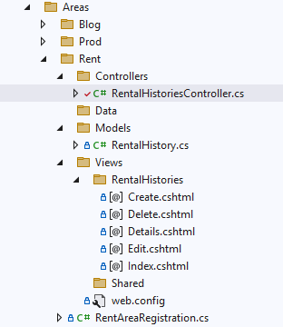
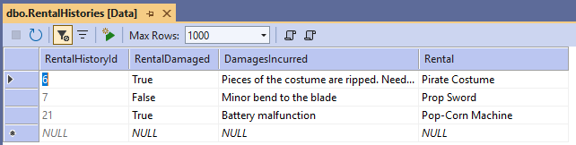
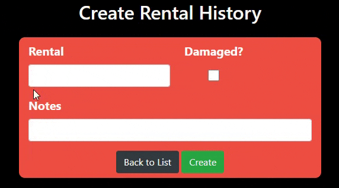
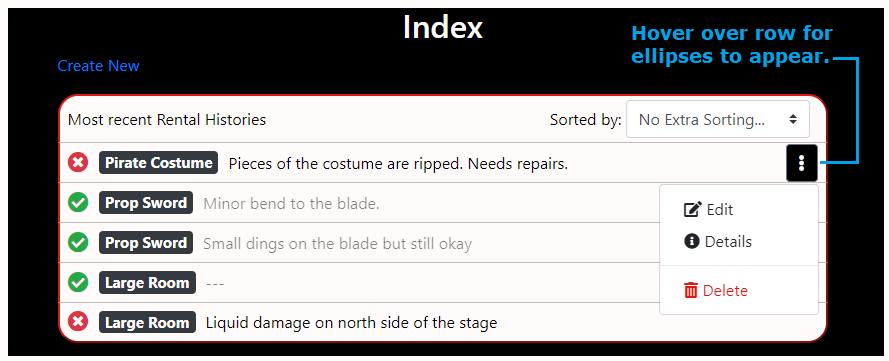

# 🎭 TheatreCMS Project

> An ASP.NET MVC and Entity Framework web application for managing content and productions for a theater/acting company.

---

##  Overview

This project serves as an interactive website and content management system (CMS) for a theater company.  
It is designed for users **who are not technically savvy** and want to easily manage their website’s content.  

The system provides:
- A clean interface for updating pages and media.
- Login capabilities for subscribers.
- A wiki of past performances and performers.

>  The project is divided into three main categories: **Rental**, **Blog**, and **Production**.  
> My contributions focused on the **Rental** category.
---

##  Tech Stack

- **Framework:** ASP.NET MVC  
- **Database:** Entity Framework  
- **Languages:** C#, HTML, CSS, JavaScript, jQuery  
- **UI Framework:** Bootstrap  
- **Version Control:** Git / GitHub  

---

## Project Stucture (After I finished the stories)

Solution/
└── TheatreCMS3/
    ├── App_Data
    ├── App_Start/
    │   ├── [BundleConfig.cs](Files\BundleConfig.cs) 
    │   └── ...
    ├── App_Themes
    ├── Areas/
    │   ├── Blog
    │   ├── Prod
    │   └── Rent/
    │       ├── Controllers/
    │       │   └── [RentalHistoriesConstroller.cs](Files/Controllers/RentalHistoriesController.cs)
    │       ├── Data
    │       ├── Models/
    │       │   └── [RentalHistory.cs](Files/Models/RentalHistory.cs)
    │       ├── Views/
    │       │   ├── RentalHistories/
    │       │   │   ├── [Create.cshtml](Files/RentalHistories/Create.cshtml)
    │       │   │   ├── [Delete.cshtml](Files/RentalHistories/Delete.cshtml)
    │       │   │   ├── [Details.cshtml](Files/RentalHistories/Details.cshtml)
    │       │   │   ├── [Edit.cshtml](Files/RentalHistories/Edit.cshtml)
    │       │   │   └── [Index.cshtml](Files/RentalHistories/Index.cshtml)
    │       │   └── ...
    │       └── RentAreaRegistration.cs  
    ├── Content/
    │   ├── Areas/
    │   │   ├── [Rent.css](Files/Content/Rent.css)
    │   │   └── ...
    │   ├── Site.css
    │   └── ...    
    ├── Controllers
    ├── Data
    ├── Helpers
    ├── Migrations
    ├── Models
    ├── Scripts/
    │   ├── Areas/
    │   │   ├── [Rent.js](Files/Scripts/Rent.js)
    │   │   └── ...
    │   ├── Site.js
    │   └── ...
    ├── UIUX
    ├── Views
    ├── wefonts
    ├── .editorconfig
    ├── favicon.ico
    ├── Global.asax
    ├── packages.config
    ├── Startup.cs
    └── Web.config
   
---

##  Project Rules

```text
• Never break the master branch.
• Don’t update NuGet packages (including Bootstrap) on master.
• Never delete code — comment it out instead.
• Don’t override Bootstrap or framework classes; create custom ones.
• Check with the manager before doing extra work.
• Never delete or modify migrations in master.
• Test thoroughly before submitting.
• Name branches by story number and follow story points.
• Follow acceptance criteria exactly.
• Use documentation as a reference, not a copy-paste source.
• Leave helpful comments and pseudocode.
• Research, ask for help, and prioritize simple, robust solutions.
```

---

##  Stories 

---

### **Story #1: Rental History Entity + CRUD Pages**

**They asked me to:**  
- Create an entity model for Rental History and CRUD pages.

**What I did:**
- Created the **RentalHistory** model with properties such as RentalName, RentalDate, RentalDamaged, and DamagesIncurred.

``` csharp
using System;
using System.ComponentModel.DataAnnotations;

namespace YourProjectName.Areas.Rental.Models
{

    // Rental History Model
    public class RentalHistory
    {
        [Key] // Primary Key
        public int RentalHistoryId { get; set; }

        [Display(Name = "Rental Damage")] // Shows the label "Rental Damage" in the UI
        public bool RentalDamaged { get; set; }

        [Display(Name = "Damage Incurred")] // Shows the label "Damage Incurred" in the UI
        public string DamagesIncurred { get; set; }

        public string Rental { get; set; }
    }
}
```

- Added the **RentalHistoriesController** using scaffolding for CRUD operations.



- Configured the **DbSet** in the context and ran migrations and verified the CRUD functionality through the database and browser.




---


### **Story #2: Create & Edit Page Styling + Dynamic Label Change**

**They asked me to:**  
> - Style Create/Edit pages to match the design reference:
> 
> - Align "Rental" and "RentalDamaged" fields horizontally.
> - Restrict form width (~600px).
> - Center the Create and Back to List buttons.
> - Add JS/jQuery to dynamically change the label between “Notes” and “Damages Incurred” based on the checkbox state.


**✅ What I did:**
- Styled the form layout using Bootstrap’s grid system and custom CSS. Used **Content/Areas/Rent.css** to keep Rent-specific styles separate from **Content/Site.css**, and **Scripts/Areas/Rent.js** to isolate Rent-specific functionality from **Scripts/Site.js**. Both files were added to **BundleConfig.cs** for bundling and optimization.

- Restricted form width using a container class (max-width: 600px; margin: auto;).
- Aligned the checkbox inline with the Rental field.
- Centered both action buttons inside the form.
- Implemented jQuery to toggle the label text dynamically:
``` javascript
//If the checkbox is checked (Rental is damaged) show the "Damages Incurred" text.  
// If the checkbox is not checked (Rental not damaged), the label should have the text "Notes"
document.addEventListener("DOMContentLoaded", function () {
    const checkbox = document.getElementById("rentalDamaged");
    const label = document.getElementById("damagesLabel");

    function updateLabel() {
        if (checkbox.checked) {
            label.textContent = "Damages Incurred";
        } else {
            label.textContent = "Notes";
        }
    }

    // Run once on page load
    updateLabel();

    // Run whenever checkbox changes
    checkbox.addEventListener("change", updateLabel);
});
```

---

### **Story #3: Index Page Layout + Icons + Dropdown**

**They asked me to:**  
> - Display all Rental Histories in a stylized table or Bootstrap layout.
> 
> - Add green ✔️ for undamaged and red ❌ for damaged rentals using Font Awesome.
> - Use badges for Rental names.
> - Truncate text with ellipses.
> - Add a dropdown with Edit, Details, Delete options visible on hover.


**What I did:**
- Replaced the default table with a Bootstrap card-based layout.
- Styled the **Most recent Rental Histories** with Bootstrap and CSS.
- Created a hover dropdown menu for actions (Edit, Details, Delete) I used **Bootstrap Icons** 
(I added an extra function for the three dot menu that drops when you hover but also stays open if you click it.):
``` csharp
@* ---------------- RIGHT SIDE: Three Dots Dropdown ---------------- *@
<div class="dropdown">
    @* Button with three dots to open dropdown menu *@
    <button class="btn btn-outline-dark threedot-btn" type="button"
            id="menuButton-@item.RentalHistoryId" data-toggle="dropdown"
            aria-haspopup="true" aria-expanded="false">
        <svg xmlns="http://www.w3.org/2000/svg" width="16" height="16"
             fill="currentColor" viewBox="0 0 16 16">
            <path d="M9.5 13a1.5 1.5 0 1 1-3 0 1.5 1.5 0 0 1 3 0m0-5a1.5 1.5 0 1 1-3 0 1.5 1.5 0 0 1 3 0m0-5a1.5 1.5 0 1 1-3 0 1.5 1.5 0 0 1 3 0" />
        </svg>
    </button>

    @* Dropdown menu *@
    <div class="dropdown-menu dropdown-menu-right" aria-labelledby="menuButton-@item.RentalHistoryId">

        @* Edit *@
        <a href="@Url.Action("Edit", new { id = item.RentalHistoryId })"
           class="dropdown-item d-flex align-items-center">
            <svg xmlns="http://www.w3.org/2000/svg" width="16" height="16" fill="currentColor"
                 style="flex-shrink:0;" viewBox="0 0 16 16" class="mr-2">
                <path d="M15.502 1.94a.5.5 0 0 1 0 .706l-1.439 1.439-2.122-2.122 1.439-1.439a.5.5 0 0 1 .707 0l1.415 1.416zm-2.561 2.561L4.939 12.503H2.5V10.06l7.999-7.999 2.442 2.44z" />
                <path fill-rule="evenodd" d="M1 13.5A1.5 1.5 0 0 0 2.5 15h11a1.5 1.5 0 0 0 1.5-1.5V8a.5.5 0 0 0-1 0v5.5a.5.5 0 0 1-.5.5h-11a.5.5 0 0 1-.5-.5v-11a.5.5 0 0 1 .5-.5H8a.5.5 0 0 0 0-1H2.5A1.5 1.5 0 0 0 1 2.5v11z" />
            </svg>
            Edit
        </a>

        @* Details *@
        <a href="@Url.Action("Details", new { id = item.RentalHistoryId })"
           class="dropdown-item d-flex align-items-center">
            <svg xmlns="http://www.w3.org/2000/svg" width="16" height="16" fill="currentColor"
                 style="flex-shrink:0;" viewBox="0 0 16 16" class="mr-2">
                <path d="M8 16A8 8 0 1 0 8 0a8 8 0 0 0 0 16m.93-9.412-1 4.705c-.07.34.029.533.304.533.194 0 .487-.07.686-.246l-.088.416c-.287.346-.92.598-1.465.598-.703 0-1.002-.422-.808-1.319l.738-3.468c.064-.293.006-.399-.287-.47l-.451-.081.082-.381 2.29-.287zM8 5.5a1 1 0 1 1 0-2 1 1 0 0 1 0 2" />
            </svg>
            Details
        </a>

        @* Delete *@
        <a href="@Url.Action("Delete", new { id = item.RentalHistoryId })"
           class="dropdown-item d-flex align-items-center text-danger">
            <svg xmlns="http://www.w3.org/2000/svg" width="16" height="16" fill="currentColor"
                 style="flex-shrink:0;" viewBox="0 0 16 16" class="mr-2">
                <path d="M2.5 1a1 1 0 0 0-1 1v1a1 1 0 0 0 1 1H3v9a2 2 0 0 0 2 2h6a2 2 0 0 0 2-2V4h.5a1 1 0 0 0 1-1V2a1 1 0 0 0-1-1H10a1 1 0 0 0-1-1H7a1 1 0 0 0-1 1zm3 4a.5.5 0 0 1 .5.5v7a.5.5 0 0 1-1 0v-7a.5.5 0 0 1 .5-.5M8 5a.5.5 0 0 1 .5.5v7a.5.5 0 0 1-1 0v-7A.5.5 0 0 1 8 5m3 .5v7a.5.5 0 0 1-1 0v-7a.5.5 0 0 1 1 0" />
            </svg>
            Delete
        </a>

    </div>
</div>
```


``` javascript
//-------------------------------------------------------
// Index.cshtml 
//-------------------------------------------------------

//Three dot menu open when hover and also stay open when click
$(document).ready(function () {
    let isClicked = false;

    $('.threedot-btn').on('click', function (e) {
        e.stopPropagation(); // Prevent document click from immediately closing
        isClicked = true;

        let $dropdown = $(this).parent('.dropdown');
        $('.dropdown').not($dropdown).removeClass('show').find('.dropdown-menu').removeClass('show'); // close others

        $dropdown.toggleClass('show');
        $dropdown.find('.dropdown-menu').toggleClass('show');
    });

    $('.threedot-btn').parent('.dropdown').hover(
        function () {
            if (!isClicked) {
                $(this).addClass('show');
                $(this).find('.dropdown-menu').addClass('show');
            }
        },
        function () {
            if (!isClicked) {
                $(this).removeClass('show');
                $(this).find('.dropdown-menu').removeClass('show');
            }
        }
    );

    // Close when clicking anywhere else
    $(document).on('click', function () {
        if (isClicked) {
            $('.dropdown').removeClass('show');
            $('.dropdown-menu').removeClass('show');
            isClicked = false;
        }
    });
});
```


---

## **Story #4: Sorting Functionality**

**They asked me to:**  
> - Sort RentalHistories from most recent to oldest by default.
> - Add a dropdown for user sorting options:
>   - No Extra Sorting
>    - Damaged Rentals
>   - Undamaged Rentals
>   - Rentals A–Z
>   - Rentals Z–A
>
> - Implement sorting without reloading the page (AJAX or JS).

**What I did:**

- Implemented JavaScript-based sorting for instant user interaction:
```javascript
// Sorted by

document.addEventListener("DOMContentLoaded", function () {
    const sortSelect = document.getElementById("sortSelect");
    const tbody = document.querySelector(".index-table tbody");

    // Convert NodeList to array
    function getRowsArray() {
        return Array.from(tbody.querySelectorAll("tr"));
    }

    // Sort rows
    function sortRows(criteria) {
        const rows = getRowsArray();

        rows.sort((a, b) => {
            const rentalA = a.querySelector(".rental-badge").textContent.trim().toLowerCase();
            const rentalB = b.querySelector(".rental-badge").textContent.trim().toLowerCase();

            const damagedA = a.querySelector(".bi-x-circle-fill") !== null;
            const damagedB = b.querySelector(".bi-x-circle-fill") !== null;

            switch (criteria) {
                case "damaged":
                    return (damagedB - damagedA); // Damaged first
                case "undamaged":
                    return (damagedA - damagedB); // Undamaged first
                case "az":
                    return rentalA.localeCompare(rentalB);
                case "za":
                    return rentalB.localeCompare(rentalA);
                default:
                    return 0; // no sorting
            }
        });

        // Append sorted rows back to tbody
        rows.forEach(row => tbody.appendChild(row));
    }

    // Listen for dropdown changes
    sortSelect.addEventListener("change", function () {
        sortRows(this.value);
    });
});
```
- Added a "select" element with sorting options and event listeners:
``` csharp
<table class="table custom-bordered-tbody table-light index-table">
    <thead>
        <tr>
            <th colspan="2">
                <div class="d-flex justify-content-between align-items-center">
                    <!-- Left side -->
                    <span class="th-text">Most Recent Rental Histories</span>

                    <!-- Right side -->
                    <div class="d-flex align-items-center">
                        <label for="sortSelect" class="m-0 th-text pl-5">Sorted by:</label>
                        <select id="sortSelect" class="form-control">
                            <option value="none">No Extra Sorting...</option>
                            <option value="damaged">Damaged Rentals</option>
                            <option value="undamaged">Undamaged Rentals</option>
                            <option value="az">Rentals A - Z</option>
                            <option value="za">Rentals Z - A</option>
                        </select>
                    </div>
                </div>
            </th>
        </tr>
    </thead>
```
