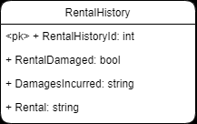

# Introduction

During my studies at **The Tech Academy**, I participated in a two-week **Live Project** where I collaborated with other developers using **Azure DevOps**, **Git version control**, and the **Agile/Scrum** framework. Each student was assigned user stories from the project board to plan, develop, and deliver within the sprint through **daily standups** and regular **code retrospectives**.

The project was a web application built with **ASP.NET MVC**, **C#**, and **Entity Framework**. It’s designed for a theater company to manage its website content without needing any technical knowledge. The application includes multiple areas to meet **administrative**, **subscriber**, and **public** needs. It provides information about current and past productions, cast members, and the current season. The system also allows the acting company to easily upload content and subscribers to manage their own subscriptions. The application was divided into three main areas: 
- Production
- Rental
- Blog 

My focus area was **Rental**.

I worked in **Visual Studio**, using **Bootstrap 4.6**. I also used **Chrome Developer Tools** to debug **HTML**, **CSS**, and **JavaScript** code, inspect **event listeners**, and adjust layout behavior.  

I utilized **AI tools** to refine my work—making my code cleaner and more efficient.

Additionally, I worked with the **console** and **terminal** to run commands, handle **Git pull requests**, resolve **merge conflicts**, and perform **migration resolutions** when needed.

## Project Requirements

Developers were required to follow strict project guidelines, including:

- Completing assigned stories according to instructor requirements.  
- Attending daily stand-ups.  
- Never updating NuGet packages (including Bootstrap).  
- Creating new CSS classes for custom styling instead of overriding Bootstrap classes.  
- Consulting the project manager before making changes outside assigned tasks.  
- Never deleting or modifying migrations on the master branch.  
- Testing all code thoroughly before submission.  
- Never breaking the master branch.  

If a roadblock occurred, developers were encouraged to troubleshoot independently, collaborate with teammates, and reach out to the instructor only as a last resort.

---

Here, I will showcase the **user stories** that were assigned to me and how I met each requirement within the given sprint.

During my studies at **The Tech Academy**, I participated in a two-week **Live Project** where I collaborated with other developers using **Azure DevOps**, **Git version control**, and the **Agile/Scrum** framework. Each student was assigned user stories from the project board to plan, develop, and deliver within the sprint through **daily standups** and regular **code retrospectives**.

### Story #1  
### Request:
Create the model and scaffold the pages within Areas > Rental following the schema:

### Methodology

